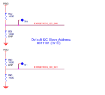
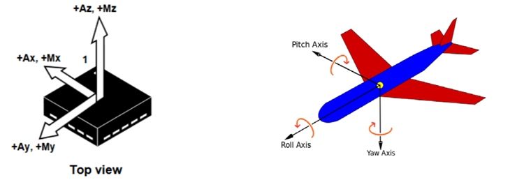
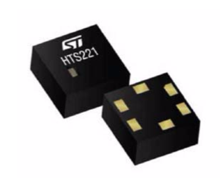

#Accelerometer Magnetometer Motion Temeperature Humidity

##Specifics for mbed

The default mbed I2C interface clock rate is 100 kHz. If you want to operate at a different frequency, you can use the i2c.
frequency(int Hz) function.
Note that mbed uses the I2C slave address in a way that can be considered to be unusual. The first byte AAAAAAADb of
an I2C access usually consists of a 7-bit address in the most significant bits followed by a direction bit (0 for write, 1 for
read). In the mbed i2c.write() and i2c.read() commands, the 8-bit I2C slave address is the specified slave address << 1. If
the sensor datasheet therefore specifies that its I2C address is 0x30, the mbed write would be i2c.write(0x70, …..) and the read will be i2c.write(0x70, ….) and what you see on the bus would be an 0x70 for a write and an 0x71 for a read.

##Sensor I2C slave addresses

###FXOS8700 Motion sensor I2C slave address

The default I2C address of the on-board FXOS8700CQ motion sensor is 0x1D, which means that 0x1D << 1 is passed to
the mbed I2C interface. A different I2C address can be selected by changing the resistors on the FRDM-K64F board as
per the schematic.

###HTS221 Temperature and Humidity sensor I2C slave address

The I2C address for the HTS221 sensor on the cellular shield is defined by the datasheet [4] as 0xBE for write and as
0xBF for read. Either of these can be passed to the mbed I2C interface, as it will use the correct direction bit. This also
implies that the 7-bit I2C address is actually 0x5F.

###Xadow GPS I2C slave address

The external Seeed Studio GPS v2 module uses a GPS L70 modulefrom Quectel that is controlled via UART from an NXP
Kinetis KL02microcontroller. The I2C address of the KL02 deviceis set to 0x05, which means that 0x05 << 1 = 0x0A is
passed to the mbed I2C interface.A diagram in paragraph 6.3.1illustrates this connection.

###Si1145 proximity and light sensor I2C slave address

The I2C address of the Si1145 proximity and light sensor on the Silicon Labs PMOD is 0x60, which means that 0x60 << 1
= 0xC0 is passed to the mbed I2C interface.

###Si7020 temperature and humidity sensor I2C slave address

The I2C address of the Si7020 temperature and humidity sensor on the Silicon Labs PMOD is 0x40, which means that
0x40 << 1 = 0x80 is passed to the mbed I2C interface.

##FXOS8700CQ motion sensor

NXP’s FXOS8700CQ 6-axis sensor with integrated linear accelerometer and magnetometer (see [3]) provides 3-azis (X, Y
and Z) acceleration information, as well as 3-axis (X, Y and Z) magnetometer information.

###Accelerometer

Acceleration in each axis is a 14-bit 2’s complement number. To convert this number to g’s, the application code
divides it by 2048 (0x800). The output of the reference design code is therefore in g’s, where one g is the gravitational
acceleration of the Earth, 9.80665 m/s2. In terms of the IC as it is mounted on the board, the acceleration axes are as in
the diagram below:

###Magnetometer

Before the magnetometer reading can be trusted though, it needs some calibration. This typically involves moving
the sensor in a figure 8 pattern for a while. Because this is a complication for stationary code development, the
magnetometer information is read, but is not currently used or communicated by the reference design.

##HTS221 Temperature and Humidity sensor

The HTS221 by STMicroelectronics is a compact digital sensor that reads relative humidity and temperature (see [4]). It is
mounted on the cellular shield. Here are some specifications:

* 0 to 100% relative humidity range
* Supply voltage: 1.7 to 3.6 V
* Low power consumption: 2 μA @ 1 Hz ODR
* Selectable ODR from 1 Hz to 12.5 Hz
* High rH sensitivity: 0.004% rH/LSB
* Humidity accuracy: ± 3.5% rH, 20 to +80% rH
* Temperature accuracy: ± 0.5 °C,15 to +40 °C
* 16-bit humidity and temperature output data
* SPI and I²C interfaces
* Tiny 2 x 2 x 0.9 mm package

Temperature readings are in Celsius but are converted to Fahrenheit by the application code.

 
