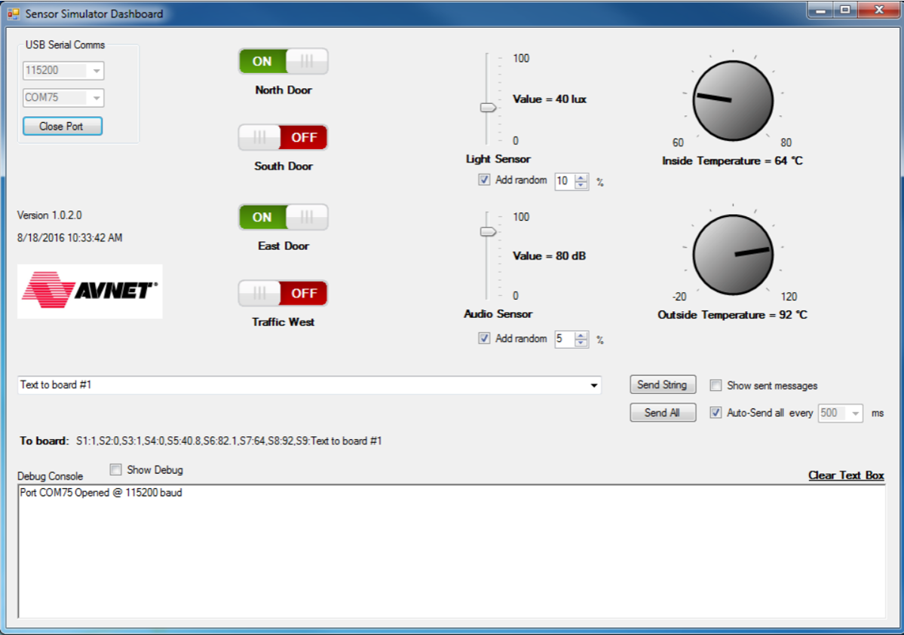

#Sensor Simulator Windows utility

##Why virtual sensors?

For testing and demonstration purposes, it is often useful to specify exactly what a sensor reading should be or to
emulate a sensor that you do not yet have access to. With this in mind Avnet created an executable that runs on a
Windows PC and provides 8 virtual sensors. Each sensor can be configured to match your system in terms of units and
range. When the PC is connected to the FRDM-K64F board via USB, the reference design automatically gets updates
from the virtual sensors in the form of a simple text string that contains their values.

##Installing and running the Sensor Simulator utility

Download the .zip file in the link below and unzip it to a location on your PC from which you have permission to run
executables. If you are not logged into cloudconnectkits.org, you will have to log in first or create a free account if you do
not have one.  
The file is available on [the Cellular IoT Starter Kit page](http://cloudconnectkits.org/product/att-cellular-iot-starter-kit "cloudconnectkits.org/product/att-cellular-iot-starter-kit") under the “Startup Files & Reference Designs” tab or directly at:

[http://cloudconnectkits.org/system/files/SensorSimulator_0.zip](http://cloudconnectkits.org/system/files/SensorSimulator_0.zip "cloudconnectkits.org/system/files/SensorSimulator_0.zip")

Close all terminal programs (like PuTTY) that are communicating with your FRDM-K64F board over USB. Now doubleclick SensorSimulator.exe in the extracted folder. Make sure the port number matches that of the board and that the
baudrate is 115200, then click  in the top left.

##Resolving problems with running the Sensor Simulator utility

###Microsoft .NET Framework version

If you get a Windows error when running the utility, it is possible that you do not have the latest version of the .NET
framework installed on your machine. This is a C# implementation developed under Microsoft Visual Studio Community
and it expects a minimum .NET framework version of 4.5.2 to run.
You can install the latest .NET version by searching for it. Currently it is version 4.6.2 that is available at

[Microsoft .NET Framework 4.6.2](https://support.microsoft.com/en-us/kb/3120737 "support.microsoft.com/en-us/kb/3120737")

If you are unsure of which version of .NET you currently have installed, you can enter the command below at a command
prompt and it will list the versions that are installed on your machine.

**dir %WINDIR%\Microsoft.Net\Framework\v\***

###Show Debug

Also, the utility takes the place of the USB serial debug terminal. You can still view debug information by checking the
“Show Debug” checkbox. But if the amount of debug information is too much and too fast, the current application may
hang. It is therefore suggested not to use this checkbox with constant high volume streams of debug text.

 

##Setting virtual sensor values

The sensors can be changed by dragging them with the mouse, which is intuitive. The two dials on the right can be
“turned” most easily by clicking on one and then using the mouse scroll wheel, if available, to turn it up or down. You can
also use your laptop’s touchpad to scroll by using a two-finger scroll gesture.
For each of the two vertical slider sensors, there is an “Add random” checkbox. This can be used to add some dithering or
noise to the sensor value. The amount of randomness added can be modified in the adjacent numeric up/down box.

 

###Sending virtual sensor values over USB and the update rate

From the sensor settings, a string with all the sensor values is composed that can be sent to the board via USB. This is
the “To board” string in the image below. This can be done manually, by clicking the “Send All” button, or by checking the
“Auto-Send all” box to its right. To change the update interval, un-check the box, change the interval value and then recheck the box again.

 

Note that in addition to the 8 virtual sensor values, a text string can also be sent to the board. This can be used to simulate
some sort of USB text input to the board. The “To board” string is received and decoded in the parse_usbhost_message()
routine in sensors.cpp in the mbed project. If you do not want to use virtual sensors or want to use the USB receive path
for a different purpose, you can comment out #define USE_VIRTUAL_SENSORS in the hardware.h file.

###Modifying virtual sensor names, units and ranges

Every time the executable is closed, a .ini file is saved with the last settings and selections. When the program is not
running, the values in this file can be edited using, for example, Notepad.  
Here the user can specify:  

* Whether a sensor is enabled (displayed on the GUI) or not
* A name for each sensor, e.g. “Light Sensor”
* A unit of measure for each sensor, e.g. “lux”
* A minimum and maximum value for the slider and dial sensors
* A default value for each sensor and selection (this will be updated when the program closes)

 

##Modifying the mbed project for the FRDM-K64F

In the config_me.h header file in the mbed project, the iSensorsToReport variable can be modified to specify which
parameters get reported to the AT&T Flow Designer.

 

###Default sensors to report to the Flow Designer

The **default** assignment for this variable (shown above) is:

**iSensorsToReport = TEMP\_HUMIDITY\_ACCELEROMETER;**

With this setting, the board reports readings from the HTS221 temperature & humidity sensor and 3-axis accelerometer
readings from the FXOS8700CQ motion sensor. These values are sent to the HTTP IN /climate port in Flow with field
names **temp**, **humidity**, **accelX**, **accelY** and **accelZ**.

If you have your mbed IoT Cellular Kit running and connected to the AT&T Flow Designer, debug messages from the HTTP
GET input should be visible in Flow. If you look at these debug messages, you will see that they contain the information for
these sensor readings in a JSON string:

“**temp**”: “93.12”, “**humidity**”: “57”, “**accelX**”: “-0.007”, “**accelY**”: “**-0.025**”, “**accelZ**”: “**0.988**”

The image below illustrates how this appears when viewed in the “Debug” tab at the bottom of the Flow canvas.

 

### Reporting, also, GPS readings to Flow Designer

If we connect the Xadow GPS module, we have to change the iSensorsToReport parameter to

**iSensorsToReport = TEMP\_HUMIDITY\_ACCELEROMETER\_GPS;**

 

###Reporting PMOD Sensor and Virtual Sensor readings to Flow Designer

Similarly, if we connect the SiLabs PMOD sensor and also want to view the virtual sensors sent over USB from the Windows
program, we have to change the iSensorsToReport parameter to

**iSensorsToReport = TEMP\_HUMIDITY\_ACCELEROMETER\_PMODSENSORS\_VIRTUALSENSORS;**

The “Debug” output window should then show us the following sensor information

 

##Reference documents

Please follow the hyperlinks below to open the relevant reference documents. At the time of the writing of
this document these links were active but in time some content could move or change.

1. Avnet’s  [AT&T Cellular IoT Kit Getting Started Guide](http://cloudconnectkits.org/product/att-cellular-iot-starter-kit "cloudconnectkits.org/product/att-cellular-iot-starter-kit")
2. NXP’s [FRDM-K64F development platform](https://developer.mbed.org/platforms/FRDM-K64F/ "developer.mbed.org/platforms/FRDM-K64F/")
3. NXP’s [FXOS8700CQ 6-axis sensor with integrated linear accelerometer and magnetometer](http://www.nxp.com/files/sensors/doc/data_sheet/FXOS8700CQ.pdf "www.nxp.com/files/sensors/doc/data_sheet/FXOS8700CQ.pdf")
4. STMicroelectronics [HTS221 Capacitive digital sensor for relative humidity and temperature](http://www.st.com/content/ccc/resource/technical/document/datasheet/4d/9a/9c/ad/25/07/42/34/DM00116291.pdf/files/DM00116291.pdf/jcr:content/translations/en.DM00116291.pdf "www.st.com/content/ccc/resource/technical/document/datasheet/4d/9a/9c/ad/25/07/42/34/DM00116291.pdf/files/DM00116291.pdf/jcr:content/translations/en.DM00116291.pdf")
5. Seeed Studio’s [Xadow GPS module v2](http://www.seeedstudio.com/depot/Xadow-GPS-v2-p-2557.html "www.seeedstudio.com/depot/Xadow-GPS-v2-p-2557.html")
6. Quectel’s [L70-R GPS Specification](http://www.quectel.com/UploadFile/Product/Quectel_L70-R_GPS_Specification_V2.1.pdf "www.quectel.com/UploadFile/Product/Quectel_L70-R_GPS_Specification_V2.1.pdf")
7. NXP’s [Kinetis KL02 microcontroller](http://www.nxp.com/files/32bit/doc/data_sheet/KL02P20M48SF0.pdf?fasp=1&WT_TYPE=Data%20Sheets&WT_VENDOR=FREESCALE&WT_FILE_FORMAT=pdf&WT_ASSET=Documentation&fileExt=.pdf "www.nxp.com/files/32bit/doc/data_sheet/KL02P20M48SF0.pdf?fasp=1&WT_TYPE=Data%20Sheets&WT_VENDOR=FREESCALE&WT_FILE_FORMAT=pdf&WT_ASSET=Documentation&fileExt=.pdf")
8. Silicon Labs [Sensor PMOD](http://pages.silabs.com/rs/silabs/images/Sensor-PMD-DataSheet.pdf "pages.silabs.com/rs/silabs/images/Sensor-PMD-DataSheet.pdf")
9. Silicon Labs [Si7020 Humidity and Temperature Sensor](https://www.silabs.com/Support%20Documents%2FTechnicalDocs%2FSi7020-A20.pdf "www.silabs.com/Support%20Documents%2FTechnicalDocs%2FSi7020-A20.pdf")
10. Silicon Labs [Si1145 Proximity, UV and Ambient Light Sensor](https://www.silabs.com/Support%20Documents/TechnicalDocs/Si1145-46-47.pdf "www.silabs.com/Support%20Documents/TechnicalDocs/Si1145-46-47.pdf")

