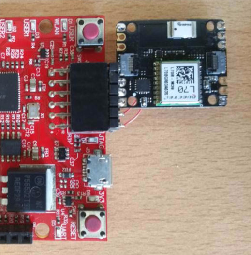

#Xadow GPS

The Seeed Studio GPS v2 module (see [5]) uses a GPS L70 module from Quectel (see [6]). The GPS is controlled via
UART from an NXP Kinetis KL02, which is a Cortex-M0 microcontroller (see [7]). The module features an integrated chip
antenna. There are miniature Xadow connectors also that can be used for prototyping compact systems. This reference
design does not use those connectors.

Here are some specifications:

* 0 to 100% relative humidity range
* Supply voltage: 1.7 to 3.6 V
* Low power consumption: 2 μA @ 1 Hz ODR
* Selectable ODR from 1 Hz to 12.5 Hz
* High rH sensitivity: 0.004% rH/LSB
* Humidity accuracy: ± 3.5% rH, 20 to +80% rH
* Temperature accuracy: ± 0.5 °C,15 to +40 °C
* 16-bit humidity and temperature output data
* SPI and I²C interfaces
* Tiny 2 x 2 x 0.9 mm package
* Power Supply: 3.3 – 6 V (via breakout pins)
* Clock Speed: 48 MHz
* Power Consumption: 18mA@Tracking, 21mA@Acquisition
* Power Saving: Typ. 3mA@AlwaysLocateTM, 7uA@Backup Mode, 180uA@Standby Mode
* Channel: 22(Tracking) / 66 (Acquisition)
* Update Rate: 1Hz(Default), up to 10Hz
* Horizontal Position Accuracy:<2.5m CEP
* Velocity Accuracy:<0.1m/s
* Maximum Velocity: Max.515m/s
* Cold/warm start with EASYTM: 15s/5s
* Tracking Sensitivity: -163dBm
* Operating Temperature: -40 to 85
* Protocols: NMEA 0183/PMTK
* Antenna Type: Chip antenna
* Interface: Interface with Xadow GSM+BLE thr
* Dimensions: 25.37mm X 20.30mm / 1’’ X 0.8’’

##GPS I2C Interface

Note that the FRDM-K64F board does not communicate with the GPS directly. It uses I2C to communicate with the
Cortex-M0 on the Xadow module, which in turn communicates with the L70 GPS via a UART.

##GPS commands

The GPS module has commands for extracting the following:

* GPS status: ‘A’ = Valid, ‘V’ = Invalid
* Satellites used: A number between 0 and 66
* UTC (Coordinated Universal Time) date and time
* Latitude in degrees and minutes
* Longitude in degrees and minutes
* Altitude in meters
* Speed (over ground) in knots
* Course in degrees

##GPS initialization time

After power-up, the Xadow GPS module will start responding to I2C messages within seconds, but it takes a while before
the GPS readings are valid. Ideally, the GPS should have an open view of the sky to track visible satellites. If the GPS is used
indoors, the walls and roofing should be permeable enough to still allow satellites to be tracked.

From indoors testing with the GPS module and cellular shield it appears that it can take from less than 5 minutes to 20
minutes for the GPS to acquire enough satellites for valid readings after a cold boot. After a warm boot, re-connection
is immediate. It seems that more than 12 satellites are not typically tracked and that for readings to be valid, at least 6
satellites have to be used.

##Waiting for GPS initialization

While the GPS is attempting to connect, the reference design application displays a ‘V’ and the number of satellites it is
seeing. A status update is obtained every 5 seconds. When that ‘V’ changes to an ‘A’, it means that the GPS readings are
valid.

**COLD BOOT:**

**WARM BOOT:**

##Wiring up the Xadow GPS module to the PMOD connector

Four signals have to be connected between the Cellular kit and the Xadow GPS module. Silkscreen text on the back side
of the GPS board identifies the signals for the holes. On the PMOD, J10 on the cellular shield, pin 1 is the pin closest to the
antenna bulkhead connectors.

| SIGNAL | J10 PMOD (SHIELD) | XADOW GPS HOLE | COLOR IN THE IMAGE BELOW |
|:------:|:-----------------:|:--------------:|:------------------------:|
|   VCC  |        Pin6       |       VCC      |            RED           |
|   GND  |        Pin5       |       GND      |           BLACK          |
|   SDA  |        Pin4       |       SDA      |           GREEN          |
|   SCL  |        Pin3       |       SCL      |          YELLOW          |

There are a number of ways to make these connections on the GPS side and the photographs below show some
examples.

**IC GRABBERS:**

**IC GRABBERS CLOSE UP:**

**HEADER PINS WITH JUMPER WIRES:**

**SOLDERED WIRES:**

**THE TWO IMAGES BELOW SHOW HOW THE GPS MODULE CAN BE WIRED TO PLUG DIRECTLY INTO A PMOD SOCKET:**

##Wiring up the Xadow GPS module to the PMOD connector

Four signals have to be connected between the Cellular kit and the Xadow GPS module. Silkscreen text on the back side
of the GPS board identifies the signals for the holes. On the PMOD, J10 on the cellular shield, pin 1 is the pin closest to the
antenna bulkhead connectors.

| SIGNAL |  ARDUINO PINS  | XADOW GPS HOLE | COLOR IN THE IMAGE BELOW |
|:------:|:--------------:|:--------------:|:------------------------:|
|   VCC  |  E.G. J3 PIN 4 |       VCC      |            RED           |
|   GND  | E.G. J3 PIN 14 |       GND      |           BLACK          |
|   SDA  |    J4 PIN 10   |       SDA      |           GREEN          |
|   SCL  |    J4 PIN 12   |       SCL      |          YELLOW          |

##Reference documents

Please follow the hyperlinks below to open the relevant reference documents. At the time of the writing of
this document these links were active but in time some content could move or change.

1. Avnet’s  [AT&T Cellular IoT Kit Getting Started Guide](http://cloudconnectkits.org/product/att-cellular-iot-starter-kit "cloudconnectkits.org/product/att-cellular-iot-starter-kit")
2. NXP’s [FRDM-K64F development platform](https://developer.mbed.org/platforms/FRDM-K64F/ "developer.mbed.org/platforms/FRDM-K64F/")
3. NXP’s [FXOS8700CQ 6-axis sensor with integrated linear accelerometer and magnetometer](http://www.nxp.com/files/sensors/doc/data_sheet/FXOS8700CQ.pdf "www.nxp.com/files/sensors/doc/data_sheet/FXOS8700CQ.pdf")
4. STMicroelectronics [HTS221 Capacitive digital sensor for relative humidity and temperature](http://www.st.com/content/ccc/resource/technical/document/datasheet/4d/9a/9c/ad/25/07/42/34/DM00116291.pdf/files/DM00116291.pdf/jcr:content/translations/en.DM00116291.pdf "www.st.com/content/ccc/resource/technical/document/datasheet/4d/9a/9c/ad/25/07/42/34/DM00116291.pdf/files/DM00116291.pdf/jcr:content/translations/en.DM00116291.pdf")
5. Seeed Studio’s [Xadow GPS module v2](http://www.seeedstudio.com/depot/Xadow-GPS-v2-p-2557.html "www.seeedstudio.com/depot/Xadow-GPS-v2-p-2557.html")
6. Quectel’s [L70-R GPS Specification](http://www.quectel.com/UploadFile/Product/Quectel_L70-R_GPS_Specification_V2.1.pdf "www.quectel.com/UploadFile/Product/Quectel_L70-R_GPS_Specification_V2.1.pdf")
7. NXP’s [Kinetis KL02 microcontroller](http://www.nxp.com/files/32bit/doc/data_sheet/KL02P20M48SF0.pdf?fasp=1&WT_TYPE=Data%20Sheets&WT_VENDOR=FREESCALE&WT_FILE_FORMAT=pdf&WT_ASSET=Documentation&fileExt=.pdf "www.nxp.com/files/32bit/doc/data_sheet/KL02P20M48SF0.pdf?fasp=1&WT_TYPE=Data%20Sheets&WT_VENDOR=FREESCALE&WT_FILE_FORMAT=pdf&WT_ASSET=Documentation&fileExt=.pdf")
8. Silicon Labs [Sensor PMOD](http://pages.silabs.com/rs/silabs/images/Sensor-PMD-DataSheet.pdf "pages.silabs.com/rs/silabs/images/Sensor-PMD-DataSheet.pdf")
9. Silicon Labs [Si7020 Humidity and Temperature Sensor](https://www.silabs.com/Support%20Documents%2FTechnicalDocs%2FSi7020-A20.pdf "www.silabs.com/Support%20Documents%2FTechnicalDocs%2FSi7020-A20.pdf")
10. Silicon Labs [Si1145 Proximity, UV and Ambient Light Sensor](https://www.silabs.com/Support%20Documents/TechnicalDocs/Si1145-46-47.pdf "www.silabs.com/Support%20Documents/TechnicalDocs/Si1145-46-47.pdf")